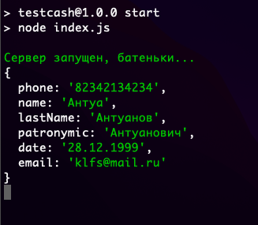

# Обработка формы 

## форма 

## Ajax

После отправки заполненной формы в браузере создаётся объект ```data``` в котором содержится данные указанные в таблице №1

Таблица №1 объект ```data```;
Имя| Пояснения 
:-|:-
phone| Номер телефона
name| Имя
lastName| Фамилия 
patronymic| Отчество
date| Дата рождения
email| Почта


### jQuery (index.js)
```javascript
    $.ajax({
        type: "POST",
        url: 'http://localhost:3001/form', 
        data: data,
        success: (result) => {
            console.log(result)
            return true // Эта страка обязательна, иначе переход по форме обработается не корректно
        },
        error: () => {
            console.log('Всё не тип топ')
        }
    })
```

Этот участок кода вы можете настроить по своему усмотрению

## Результат 
На тестовый приходят вот такие данные


